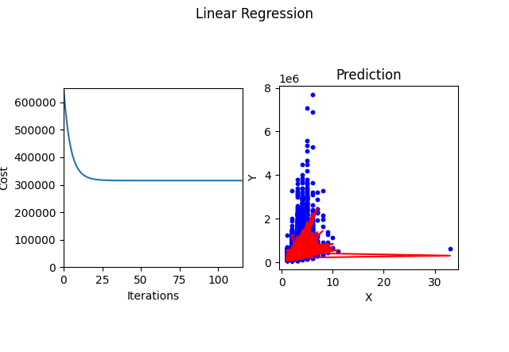

### Linear regression from scratch

This is an implementation of linear regression using only numpy (and matplotlib to plot from main).
This model uses gradient descent to train.

### Example of work



### To Run

* Download repository

```ssh
git clone https://github.com/zepif/ai-algorithms.git

cd Linear-Regression
```

* Install requirements

```ssh
pip install requirements.txt
```

* Start program

```ssh
python3 main.py
```

